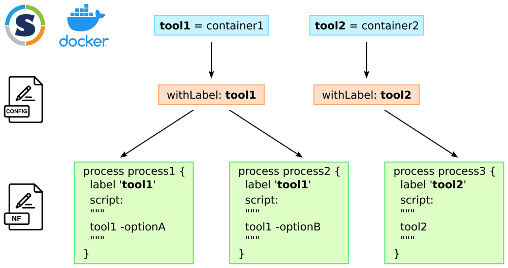

# Advanced configuration

### 1. Creating Nextflow profiles

For users running the pipeline in an HPC environment, it is necessary to set up a profile. Essentially, Nextflow [profiles](https://www.nextflow.io/docs/latest/config.html#config-profiles) define specific settings related to the job scheduler of the HPC. Various HPCs may employ different engines for job scheduling, such as SLURM, TORQUE, and LSF. 

#### 1.1 SLURM profile

The profiles should be written on the `nextflow.config` file. For HPCs, it is essential to load the `singularity` module. This instruction will replace the `module load` command.

```{ .bash .copy }

institution {

    module = 'singularity/3.7.0'

    singularity {

        enabled      = true

    }

    process {

        executor     = 'slurm'
        queue        = 'medium'

    }

    params {

        max_memory   = 128.GB
        max_cpus     = 32
        max_time     = 24.h

    }
}

```

The previous snippet creates a profile for a institution powered by SLURM. It includes several settings, such as loading modules like `singularity/3.7.0`, and specifying the job scheduling engine with the `executor` property. Nextflow works with many engines; for more details, refer to the official [documentation](https://nf-co.re/docs/usage/tutorials/step_by_step_institutional_profile). Please note that the `process` scope should match the HPC specs, i.e., queue, memory and cpus.

#### 1.2. Container and Nextflow pipelines

Note that Nextflow pipelines are integrated with containers to guarantee reproducibility and portability. This integration ensures that during the pipeline execution, each module is encapsulated within a predefined computational environment, encompassing all necessary software, libraries, and programming languages. As a result, researchers can be confident that their workflows will produce consistent results across different platforms and that these workflows can be easily shared and executed by collaborators in diverse computing environments.

{align=center}

**Figure from [Geniac](https://open-research-europe.ec.europa.eu/articles/1-76)**

---

### 2. Adding gene signatures and meta-programs


The pipeline allows flexibility regarding cell or meta-program markers. Currently, we provide two databases with curated cell markers [1](https://github.com/break-through-cancer/btc-scrna-pipeline/blob/main/assets/cell_markers_database.csv) and meta-programs [2](https://github.com/break-through-cancer/btc-scrna-pipeline/blob/main/assets/meta_programs_database.csv).

#### 2.1. Cell Markers

To customize the cell markers database, it's essential to adhere to pipeline conventions. Firstly, the table should consist of four columns, as detailed below. Most importantly, the cell type column will determine the annotation level at which the pipeline will operate.

{{ read_csv('./assets/example_cell_markers.csv') }}

!!! tip

    Note that each marker (gene) is into a single row. This long format is related with best practices for data analysis.

#### 2.1. Meta-programs

Similar to customizing cell markers, users will need to adhere to pre-established standards. The `source` column will serve as the anchor that the pipeline uses to subset the meta-programs database.

{{ read_csv('./assets/example_meta_programs.csv') }}

