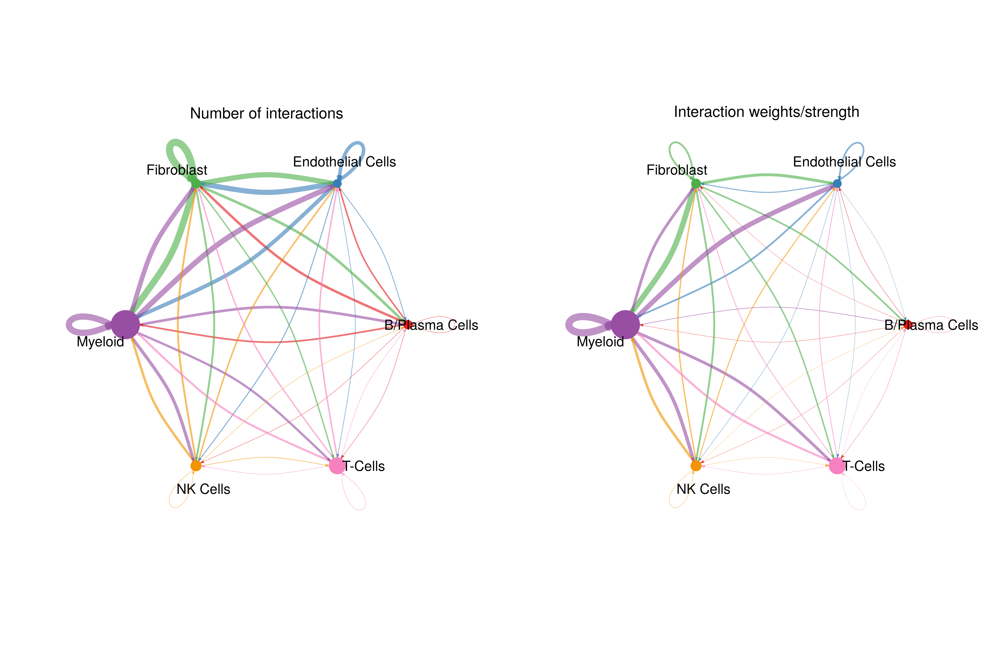

# Cell-cell communication

## Motivation

Cell-cell communication analysis offers insights into the interactions among different cell types within a tissue or tumor. These interactions form intricate networks that can reveal mechanisms associated with alterations in the tumor microenvironment and disease progression. To decipher this complex orchestration, we utilize well-established methods from the literature, specifically **CellChat** and **LIANA**.

## Step-by-step

Lorem Ipsum is simply dummy text of the printing and typesetting industry. Lorem Ipsum has been the industry's standard dummy text ever since the 1500s, when an unknown printer took a galley of type and scrambled it to make a type specimen book.

### 1. Running pipeline

#### 1.1. On HPC

!!! info "HPC"

    * `input_cell_markers_db`    = ./assets/cell_markers_database.csv
    * `input_annotation_level`   = Major cells

```{.bash .copy}

nextflow run single_cell_basic.nf --project_name Training --sample_csv sample_table.csv --meta_data meta_data.csv --cancer_type Ovarian -resume -profile seadragon

```

#### 1.2. On Cirro

Alternatively, we execute this task on [Cirro](https://cirro.bio).

!!! info "Cirro"

    * `Input cell markers`              = Default
    * `Annotation level`                = Major cells

### 2. Inspecting report

#### 2.1. LIANA output

"The bubble plot illustrates the interactions between ligand-receptor (L-R) pairs across various cell types, including interaction specificity and expression magnitude metrics. Interaction specificity measures the degree of L-R exclusivity among cell types, i.e., putative a preferential "communication" pathway. Meanwhile, expression magnitude indicates the strength of L-R interactions within a cell population."

{align=center}

The heatmap displays the interaction directionality between Sender and Receiver populations.

{align=center}

#### 2.2. CellChat output

Alternatively, we can explore results obtained exclusively from CellChat. The network displays various metrics related to interaction strength and frequency across populations. These can be further divided into cell-based plots, as detailed below.

{align=center}

{align=center}

## Reference

1. [Comparison of methods and resources for cell-cell communication inference from single-cell RNA-Seq data](https://www.nature.com/articles/s41467-022-30755-0)
2. [Inference and analysis of cell-cell communication using CellChat](https://www.nature.com/articles/s41467-021-21246-9)