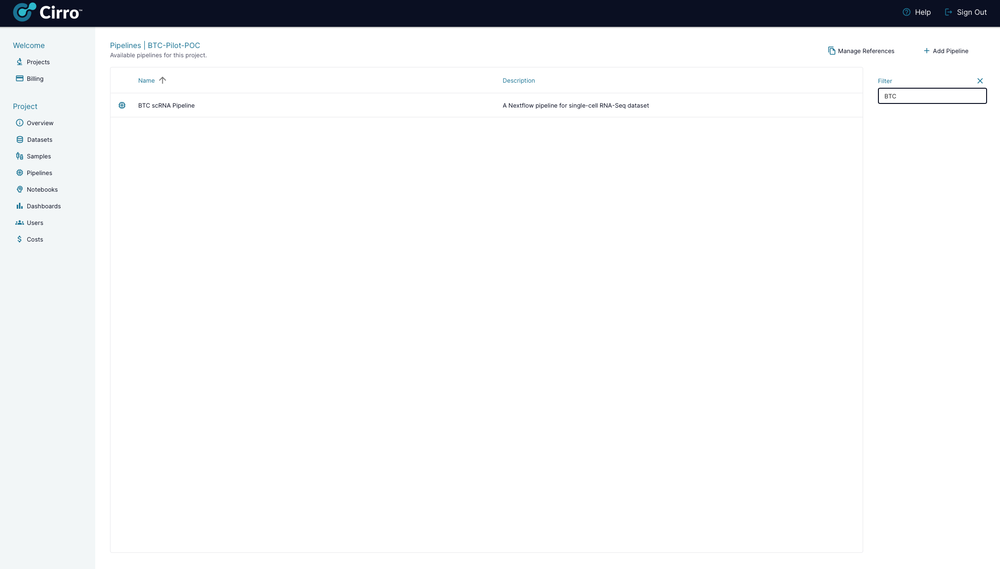
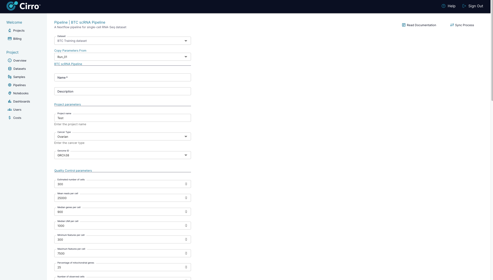

# Introduction to Cirro

Cirro is a cloud platform that simplifies access to cutting-edge pipelines to address common research challenges. Central to Cirro's mission is enhancing the research experience, enabling users to concentrate on scientific inquiries rather than software. Throughout this training, we will be incorporating Cirro in several tutorials.

## Pipelines area

{align=center}

## BTC scRNA settings

When configuring the pipeline form, there are a few essential settings for this training. Ensure the `Dataset` is set to **BTC Training dataset** and the `Copy Parameters From` option is selected as **Run_01**.

{align=center}
