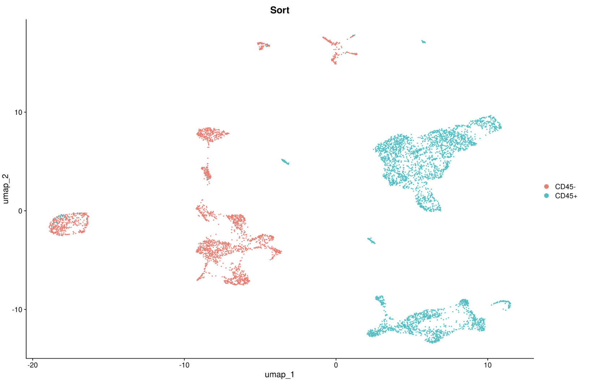

# Cell stratification and CNV

## Motivation

Distinguishing malignant cells from normal cells remains a significant challenge in single-cell transcriptomics. To confidently identify malignant cells among other cell populations, multiple pieces of evidence are necessary. In our pipeline, we have incorporated two common types of evidence: gene signatures and CNV analysis.

## Step-by-step

In this module, we employ a conservative strategy, offering users the choice between two distinct methods for identifying malignant populations: i) the inferCNV-based method, and ii) the consensus score. The consensus score is a method currently under development, which amalgamates gene signatures, various CNV predictions, and cluster/patient specificity.

### 1. Running pipeline

```{.bash .copy}

nextflow run single_cell_basic.nf --project_name Training --sample_csv sample_table.csv --meta_data meta_data.csv --cancer_type Ovarian -resume -profile seadragon

```

By default the previous command line considers thresholds.

!!! info "HPC"

    * `input_stratification_method`   = infercnv_label
    * `thr_cluster_size`              = 1000
    * `thr_consensus_score`           = 2

Alternatively, we execute this task on [Cirro](https://cirro.bio).

!!! info "Cirro"

    * `Method to define stratification labels`            = 2000
    * `Defining cluster size limit`                       = auto
    * `Consensus score threshold (Beta)`                  = source_name,Sort

### 2. Inspecting report

#### 2.1. InferCNV predictions

The first UMAP displays malignancy status based on inferCNV predictions. By default, the pipeline will utilize this annotation for downstream analysis. The inferCNV leverages in a hidden Markov model (HMM) to identify copy number variations (CNVs) status based on expression data. It is a time-consuming task, therefore we applied a heuristic to subsampling cells per cluster, `thr_cluster_size`. In summary, the method performs well, but it has limitations displaying misassigned cells, and low accuracy in small populations.

{align=center}

!!! warning

    InferCNV predictions are carried out in two distinct modes: reference-based, which leverages known malignant cells from the single-cell experiment, and reference-free mode, which employs a statistical procedure to estimate the CNV load cut-off. Currently, we utilize the reference-free mode. **The pipeline stores the inferCNV heatmap in the data folder**.

#### 2.2. Consensus approach (under development)

Alternatively, we also offer annotations based on the consensus approach (**under development**), which appears to more effectively capture smaller cell populations. However, neither approach can be considered flawless.

{align=center}

!!! info

    The user can change malignancy classifier by switching the parameter, `input_stratification_method`. The options are **infercnv_label** or **consensus_label**.

#### 2.3. CD45 marker based on FACS


{align=center}

The malignancy prediction can generally be correlated with CD45 status (protein-level expression). However, minor discrepancies might be linked to the presence of **normal** epithelial cells in the dataset.

## Reference